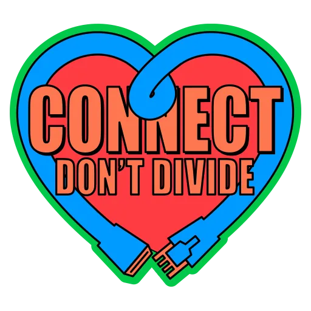

# Browsers

# Mozilla

-   `https://addons.mozilla.org/en-US/firefox/addon/private-relay/`
-   `https://addons.mozilla.org/en-US/firefox/addon/multi-account-containers/`
-   `https://addons.mozilla.org/en-US/firefox/addon/ublock-origin`
-   `https://addons.mozilla.org/en-US/firefox/addon/bitwarden-password-manager`
-   `https://addons.mozilla.org/en-US/firefox/addon/decentraleyes`
-   `https://addons.mozilla.org/en-US/firefox/addon/privacy-badger17`
-   `https://addons.mozilla.org/en-US/firefox/addon/https-everywhere`
-   `https://addons.mozilla.org/en-US/firefox/addon/darkreader`
-   `https://addons.mozilla.org/en-US/firefox/addon/duckduckgo-for-firefox`
