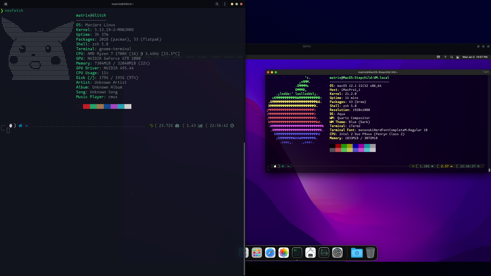

# MacOS

# Apple_Notes

🍎️🗒️

## Apple Networking

* * *

-   `sudo ipconfig set en0 DHCP`

    -   Renew DHCP Lease.

-   `sudo dscacheutil -flushcache && sudo killall -HUP mDNSResponder`

    -   Clear DNS Cache.

### Avahi Daemon

```bash
# Disable
sudo defaults write /System/Library/LaunchDaemons/com.apple.mDNSResponder.plist ProgramArguments -array-add "-NoMulticastAdvertisements"

# Enable (Default)
sudo defaults write /System/Library/LaunchDaemons/com.apple.mDNSResponder.plist ProgramArguments -array "/usr/sbin/mDNSResponder" "-launchd"
```

* * *

### Wireless:

-   `/System/Library/PrivateFrameworks/Apple80211.framework/Versions/Current/Resources/airport -I | awk '/ SSID/ {print substr($0, index($0, $2))}'`

    -   Show current `SSID`.

* * *

-   `defaults read /Library/Preferences/SystemConfiguration/com.apple.airport.preferences | grep LastConnected -A 7`

    -   Show Connection History.

* * *

-   `security find-generic-password -D "AirPort network password" -a "SSID" -gw`

    -   Show SSID Passwords.

* * *

-   `networksetup -setairportpower en0 on`

    -   Turn on wifi Adapter.

### Measure Wireless Strength from CLI:

```bash
#!/bin/zsh
while i=1; do echo -ne 'Wifi signal strength:' $(/System/Library/PrivateFrameworks/Apple80211.framework/Versions/Current/Resources/airport -I | grep CtlRSSI | awk {'print $2'}) '\r'; sleep 0.5; done
```

* * *

## Filevault

-   `sudo fdesetup status`

    -   Filevault Status.

-   `sudo fdesetup enable`

    -   Filevault Enable.

-   `sudo sysdiagnose -f ~/Desktop/`

    -   Run performance / diagnostic and place results on the Desktop.

* * *

## Kernel Extensions

`sudo kextstat -l`

-   List Kernel Extensions

`sudo kextunload -b com.apple.driver.ExampleBundle`

-   Unload Kernel Extensions

## Updates

`sudo softwareupdate -ia`

-   Install all available updates.

`defaults write com.apple.SoftwareUpdate ScheduleFrequency -int 1`

-   Change the Update Checking Interval.

`sudo softwareupdate --list`

-   Show available updates.

`mdutil -E /path/to/volume`

-   Erase & Rebuild `Spotlight` Search.

* * *

## Logs & Reporting:

### Generate Advanced System & Performance Report:

```bash
sudo sysdiagnose -f ~/Desktop/
```

-   System Log Directory:

    -   `/var/log`

-   System Log:

    -   `/var/log/system.log`

-   Mac Analytics Data:

    -   `/var/log/DiagnosticMessages`

-   System Application Logs:

    -   `/Library/Logs`

-   System Reports:

    -   `/Library/Logs/DiagnosticReports`

-   User Reports:

    -   `~/Library/Logs/DiagnosticReports`

* * *

## Bootable USB Installer:

```bash
    # macOS 11 (Big Sur)
    sudo /Applications/Install\ macOS\ Big\ Sur.app/Contents/Resources/createinstallmedia --volume /Volumes/USB --nointeraction --downloadassets

    # macOS 10.15 (Catalina)
    sudo /Applications/Install\ macOS\ Catalina.app/Contents/Resources/createinstallmedia --volume /Volumes/USB --nointeraction --downloadassets

    # macOS 10.14 (Mojave)
    sudo /Applications/Install\ macOS\ Mojave.app/Contents/Resources/createinstallmedia --volume /Volumes/USB --nointeraction --downloadassets

    # macOS 10.13 (High Sierra)
    sudo /Applications/Install\ macOS\ High\ Sierra.app/Contents/Resources/createinstallmedia --volume /Volumes/USB --applicationpath /Applications/Install\macOS\ High\ Sierra.app

    # macOS 10.12 (Sierra)
    sudo /Applications/Install\ macOS\ Sierra.app/Contents/Resources/createinstallmedia --volume /Volumes/USB --applicationpath /Applications/Install\ macOS\Sierra.app

    # OS X 10.11 (El Capitan)
    sudo /Applications/Install\ OS\ X\ El\ Capitan.app/Contents/Resources/createinstallmedia --volume /Volumes/USB --applicationpath /Applications/Install\ OS\X\ El\ Capitan.app

    # OS X 10.10 (Yosemite)
    sudo /Applications/Install\ OS\ X\ Yosemite.app/Contents/Resources/createinstallmedia --volume /Volumes/USB --applicationpath /Applications/Install\ OS\ X\Yosemite.app
```

* * *

## Initial Configuration & Setup:

> TO DO.

* * *

## Links:

### MacOS Deployment Overview:

-   [Deployment Overview.](https://www.apple.com/business/docs/site/Mac_Deployment_Overview.pdf)
-   [AppleSeed IT Guide.](https://www.apple.com/business/docs/resources/AppleSeed_for_IT_Guide.pdf)
-   [MacOS SSO.](https://support.apple.com/guide/deployment-reference-macos/single-sign-on-extension-apdac83c038d/web)
-   [Identity Mgmt.](https://support.apple.com/guide/deployment-reference-macos/intro-to-identity-management-apd28d472300/web)

### MacOS Networking Articles:

-   [WiFi Coverage.](https://support.apple.com/guide/deployment-reference-macos/getting-proper-wi-fi-coverage-iorb54f75587/web)
-   [fkn mDNS.](https://support.apple.com/guide/deployment-reference-macos/intro-to-bonjour-apd0401947ff/web)
-   [AD Integration.](https://support.apple.com/guide/deployment-reference-macos/integrating-macos-with-active-directory-iorbeda89d1d/web)
-   [Private Relay.](https://support.apple.com/en-us/HT212614)


* * *

### MacOS Support Pages:

Useful for users.

-   MacOS / Device Network Ports:

    -   <https://support.apple.com/en-us/HT210060>

-   Apple Preboot Key Combinations / Hot Keys:

    -   <https://support.apple.com/en-us/HT201255>

-   Reset SMC Chip:

    -   <https://support.apple.com/en-us/HT201295>

-   Reset PRRAM/NVRAM:

    -   <https://support.apple.com/en-us/HT204063>

-   Reinstalling MacOS from Recovery:

    -   <https://support.apple.com/en-us/HT204904>

-   Check Apple Warranty:

    -   <https://checkcoverage.apple.com/>

-   Misc. Support Site:

    -   <https://getsupport.apple.com>

* * *

## MacOS VMs:

> TO-DO.

